# 🤖 AutoHeal Locator

[](https://github.com/SanjayPG/autoheal-locator/releases)
[](https://github.com/SanjayPG/autoheal-locator/actions)
[](https://opensource.org/licenses/MIT)
[](https://adoptium.net/)

**AI-powered Selenium element locator that automatically heals broken locators using advanced AI models.** When your element locators break due to UI changes, AutoHeal intelligently finds the elements using DOM analysis, visual recognition, and smart fallback strategies across all Selenium locator types.

## 🚀 Why AutoHeal?

Traditional test automation fails when developers change the UI. AutoHeal solves this by:

- **🔍 Intelligent Element Detection**: Uses AI to find elements with DOM analysis and visual recognition
- **🎯 Multiple Locator Types**: Supports CSS, XPath, ID, Name, Class, Tag, Link Text strategies
- **🧠 Multiple AI Providers**: Google Gemini, OpenAI, Anthropic Claude, and more
- **🔄 Smart Healing Strategies**: DOM analysis, visual analysis, hybrid, and cached approaches
- **⚡ High-Performance Caching**: Remembers successful fixes to avoid repeated AI calls
- **📊 Comprehensive Reporting**: Detailed insights into healing activities and costs
- **🔄 Selenium Integration**: Drop-in replacement for `driver.findElement()`

---

## 📦 Installation Methods

Choose one of the following installation methods:

### Method 1: GitHub Packages (Recommended)

#### Step 1: Add GitHub Packages Repository

Add this to your `pom.xml`:

```xml
<repositories>
  <repository>
    <id>central</id>
    <url>https://repo.maven.apache.org/maven2</url>
  </repository>
  <repository>
    <id>github</id>
    <url>https://maven.pkg.github.com/SanjayPG/autoheal-locator</url>
  </repository>
</repositories>
```

> **⚠️ Important**: Include Maven Central repository to ensure other dependencies (JUnit, Selenium, etc.) are downloaded correctly.

#### Step 2: Add Maven Dependency

```xml
<dependency>
  <groupId>com.autoheal</groupId>
  <artifactId>autoheal-locator</artifactId>
  <version>1.0.0</version>
</dependency>
```

#### Step 3: Configure GitHub Token

Create `~/.m2/settings.xml`:

**Windows**: `C:\Users\<YourUsername>\.m2\settings.xml`
**Mac**: `/Users/<YourUsername>/.m2/settings.xml`
**Linux**: `/home/<YourUsername>/.m2/settings.xml`

```xml
<settings>
  <servers>
    <server>
      <id>github</id>
      <username>YOUR_GITHUB_USERNAME</username>
      <password>YOUR_GITHUB_TOKEN</password>
    </server>
  </servers>
</settings>
```

> **📝 Note**: Generate a GitHub token at https://github.com/settings/personal-access-tokens with `read:packages` scope.
> **💡 Windows Tip**: Run `echo %USERPROFILE%` in Command Prompt to find your user directory path.
> **💡 Mac/Linux Tip**: Run `echo $HOME` in Terminal to find your home directory path.

---

### Method 2: Download JAR Directly

1. **Download the JAR file** from [GitHub Releases](https://github.com/SanjayPG/autoheal-locator/releases)
2. **Create a `lib` folder** in your project root
3. **Copy the JAR** to `lib/autoheal-locator-1.0.0.jar`

#### Option A: Add to IDE Build Path (No Maven needed)

**IntelliJ IDEA:**
- Right-click project → Open Module Settings → Libraries → + → Java → Select the JAR

**Eclipse:**
- Right-click project → Build Path → Configure Build Path → Libraries → Add JARs → Select the JAR

**VS Code:**
- Add to `.classpath` or configure in `settings.json`

#### Option B: Add to Maven POM

```xml
<dependency>
  <groupId>com.autoheal</groupId>
  <artifactId>autoheal-locator</artifactId>
  <version>1.0.0</version>
  <scope>system</scope>
  <systemPath>${project.basedir}/lib/autoheal-locator-1.0.0.jar</systemPath>
</dependency>
```

> **⚠️ Note**: You'll also need to manually download all transitive dependencies (Selenium, etc.)

---

### Method 3: Build from Source

1. **Clone the repository**:
```bash
git clone https://github.com/SanjayPG/autoheal-locator.git
cd autoheal-locator
```

2. **Build the project** (skip tests):
```bash
mvn clean install -DskipTests
```

3. **Use in your project** - Add this to your `pom.xml`:
```xml
<dependency>
  <groupId>com.autoheal</groupId>
  <artifactId>autoheal-locator</artifactId>
  <version>1.0.1-SNAPSHOT</version>
</dependency>
```

> **📝 Note**: Building from source creates a SNAPSHOT version. The JAR will be installed in your local Maven repository (`~/.m2/repository/com/autoheal/autoheal-locator/1.0.1-SNAPSHOT/`)

---

### Method 4: Maven Central (Coming Soon)

```xml
<dependency>
  <groupId>com.autoheal</groupId>
  <artifactId>autoheal-locator</artifactId>
  <version>1.0.0</version>
</dependency>
```

> **📢 Status**: Publication to Maven Central is in progress. Once available, no additional repository configuration will be needed.

---

## 🏃‍♂️ Quick Start (5 Minutes)

### 1. Set Your AI API Key

```bash
# Windows
set GEMINI_API_KEY=your-api-key-here
echo %GEMINI_API_KEY%

# Mac/Linux
export GEMINI_API_KEY=your-api-key-here
echo $GEMINI_API_KEY
```

> **🔑 Get API Key**: Visit https://makersuite.google.com/app/apikey
> **✅ Verify**: Run the `echo` command to confirm the key is set correctly

### 2. Replace Your WebDriver Code

**Before AutoHeal:**
```java
WebDriver driver = new ChromeDriver();
WebElement button = driver.findElement(By.id("submit-btn"));
button.click();
```

**After AutoHeal:**
```java
WebDriver driver = new ChromeDriver();
AutoHealLocator autoHeal = AutoHealManager.createMinimalAutoHeal(driver);
// AutoHeal auto-detects locator type and heals if needed
WebElement button = autoHeal.findElement("submit-btn", "Submit button"); // ID
// OR WebElement button = autoHeal.findElement("#submit-btn", "Submit button"); // CSS
// OR WebElement button = autoHeal.findElement("//button[@id='submit-btn']", "Submit button"); // XPath
button.click();
```

### 3. Run Your Test

```bash
mvn test
```

**Result**: When locators break, AutoHeal automatically finds the correct elements using AI DOM analysis, visual recognition, and smart healing strategies! 🎉

---

## 🔧 Complete Setup Guide

### 1. Project Structure

Create this structure in your test project:

```
src/
├── main/java/
│   └── com/yourcompany/utils/
│       └── AutoHealManager.java
├── test/java/
│   └── com/yourcompany/tests/
│       └── YourTest.java
└── test/resources/
    ├── autoheal.properties
    └── testng.xml
```

### 2. Create AutoHeal Manager

**src/main/java/com/yourcompany/utils/AutoHealManager.java:**

<details>
<summary>📄 AutoHealManager.java (Click to expand)</summary>

```java
package com.yourcompany.utils;

import com.autoheal.AutoHealLocator;
import com.autoheal.config.AutoHealConfiguration;
import com.autoheal.config.AIConfig;
import com.autoheal.config.CacheConfig;
import com.autoheal.config.PerformanceConfig;
import com.autoheal.model.AIProvider;
import org.openqa.selenium.WebDriver;
import java.time.Duration;

import static com.autoheal.config.ReportingConfig.enabledWithDefaults;

public class AutoHealManager {

    public static AutoHealLocator createMinimalAutoHeal(WebDriver driver) {
        AutoHealConfiguration config = AutoHealConfiguration.builder()
                .ai(AIConfig.builder()
                        .provider(AIProvider.GOOGLE_GEMINI)
                        .apiKey(System.getenv("GEMINI_API_KEY"))
                        .timeout(Duration.ofSeconds(60))
                        .maxRetries(3)
                        .build())
                .cache(CacheConfig.builder()
                        .cacheType(CacheConfig.CacheType.PERSISTENT_FILE)
                        .maximumSize(10000)
                        .expireAfterWrite(Duration.ofHours(24))
                        .expireAfterAccess(Duration.ofHours(2))
                        .recordStats(true)
                        .build())
                .performance(PerformanceConfig.builder()
                        .elementTimeout(Duration.ofSeconds(60))
                        .threadPoolSize(4)
                        .enableMetrics(true)
                        .build())
                .reporting(enabledWithDefaults())
                .build();

        return AutoHealLocator.builder()
                .withWebAdapter(new com.autoheal.impl.adapter.SeleniumWebAutomationAdapter(driver))
                .withConfiguration(config)
                .build();
    }
}
```

</details>

### 3. Configuration File

**src/test/resources/autoheal.properties:**

<details>
<summary>⚙️ autoheal.properties (Click to expand)</summary>

```properties
# AI Configuration
autoheal.ai.provider=GOOGLE_GEMINI                    # AI service (GOOGLE_GEMINI, OPENAI, ANTHROPIC_CLAUDE, DEEPSEEK, GROK, LOCAL_MODEL)
autoheal.ai.model=gemini-2.0-flash                    # AI model (gpt-4o-mini, gpt-4o, gemini-2.0-flash, claude-3-5-sonnet-20241022) - optional, uses provider default if not specified
autoheal.ai.api-key=${GEMINI_API_KEY}                 # API key from environment variable
autoheal.ai.timeout=30s                               # AI request timeout
autoheal.ai.max-retries=3                             # Retry attempts for failed AI calls
autoheal.ai.visual-analysis-enabled=true              # Enable screenshot-based element detection

# Cache Configuration
autoheal.cache.type=PERSISTENT_FILE                   # Cache type (CAFFEINE, REDIS, PERSISTENT_FILE, HYBRID)
autoheal.cache.maximum-size=10000                     # Maximum cache entries
autoheal.cache.expire-after-write=24h                 # Cache expiry after writing
autoheal.cache.expire-after-access=2h                 # Cache expiry after last access
autoheal.cache.record-stats=true                      # Enable cache statistics

# Performance Configuration
autoheal.performance.thread-pool-size=4               # Concurrent healing threads
autoheal.performance.element-timeout=45s              # Element wait timeout
autoheal.performance.enable-metrics=true              # Enable performance metrics
autoheal.performance.execution-strategy=SMART_SEQUENTIAL  # Healing strategy (DOM_ONLY, VISUAL_ONLY, SMART_SEQUENTIAL, HYBRID)

# Reporting Configuration
autoheal.reporting.enabled=true                       # Enable healing reports
autoheal.reporting.generate-html=true                 # Generate HTML reports
autoheal.reporting.generate-json=true                 # Generate JSON reports
autoheal.reporting.console-logging=true               # Log healing activities to console
autoheal.reporting.output-directory=target/autoheal-reports  # Reports output directory
```

</details>

### 4. Sample Test Class

**src/test/java/com/yourcompany/tests/LoginTest.java:**

<details>
<summary>🧪 Sample Test (Click to expand)</summary>

```java
package com.yourcompany.tests;

import com.yourcompany.utils.AutoHealManager;
import com.autoheal.AutoHealLocator;
import org.openqa.selenium.WebDriver;
import org.openqa.selenium.WebElement;
import org.openqa.selenium.chrome.ChromeDriver;
import org.testng.Assert;
import org.testng.annotations.*;

public class LoginTest {
    private WebDriver driver;
    private AutoHealLocator autoHeal;

    @BeforeMethod
    public void setUp() {
        driver = new ChromeDriver();
        autoHeal = AutoHealManager.createMinimalAutoHeal(driver);
        driver.get("https://saucedemo.com");
    }

    @Test
    public void testSuccessfulLogin() {
        // These locators might be wrong - AutoHeal will fix them automatically!
        // AutoHeal supports multiple locator types and auto-detects them
        autoHeal.findElement("username-wrong", "Username field")  // ID (auto-detected)
               .sendKeys("standard_user");

        autoHeal.findElement("#password-wrong", "Password field")  // CSS (auto-detected)
               .sendKeys("secret_sauce");

        autoHeal.findElement("//button[@id='login-btn-wrong']", "Login button")  // XPath (auto-detected)
               .click();

        // Verify login success - AutoHeal will find this even if selector changes
        WebElement inventoryTitle = autoHeal.findElement(".title", "Inventory title");
        Assert.assertEquals(inventoryTitle.getText(), "Products");
    }

    @AfterMethod
    public void tearDown() {
        if (driver != null) {
            driver.quit();
        }
    }
}
```

</details>

### 5. TestNG Configuration

**src/test/resources/testng.xml:**

```xml
<?xml version="1.0" encoding="UTF-8"?>
<suite name="AutoHeal Test Suite" verbose="1">
    <test name="Login Tests">
        <classes>
            <class name="com.yourcompany.tests.LoginTest"/>
        </classes>
    </test>
</suite>
```

---

## 🎯 Usage Examples

### Basic Usage

```java
// AutoHeal auto-detects locator types and heals if they break
WebElement button1 = autoHeal.findElement("submit", "Submit button");           // ID
WebElement button2 = autoHeal.findElement("#submit", "Submit button");         // CSS
WebElement button3 = autoHeal.findElement("//button[@id='submit']", "Submit button"); // XPath
WebElement button4 = autoHeal.findElement("btn-primary", "Submit button");     // Class Name

// Multiple elements with any locator type
List<WebElement> items = autoHeal.findElements(".product-item", "Product items");

// With explicit wait
WebElement element = autoHeal.waitForElement("#dynamic-content", "Dynamic content", 10);
```

### Page Object Model

```java
public class LoginPage {
    private AutoHealLocator autoHeal;

    public LoginPage(AutoHealLocator autoHeal) {
        this.autoHeal = autoHeal;
    }

    public void login(String username, String password) {
        // Mix different locator types - AutoHeal handles them all
        autoHeal.findElement("username", "Username field").sendKeys(username);        // ID
        autoHeal.findElement("#password", "Password field").sendKeys(password);      // CSS
        autoHeal.findElement("//button[contains(text(),'Login')]", "Login button").click(); // XPath
    }
}
```

### Advanced Configuration

```java
public static AutoHealLocator createAdvancedAutoHeal(WebDriver driver) {
    return AutoHealLocator.builder()
        .withWebAdapter(new SeleniumWebAutomationAdapter(driver))
        .withConfiguration(AutoHealConfiguration.builder()
            .ai(AIConfig.builder()
                .provider(AIProvider.OPENAI)
                .apiKey(System.getenv("OPENAI_API_KEY"))
                .timeout(Duration.ofSeconds(60))
                .maxRetries(3)
                .build())
            .cache(CacheConfig.builder()
                .cacheType(CacheConfig.CacheType.REDIS)
                .redisHost("localhost")  // or your Redis server
                .redisPort(6379)
                .expireAfterWrite(Duration.ofDays(7))
                .build())
            .performance(PerformanceConfig.builder()
                .elementTimeout(Duration.ofSeconds(60))
                .executionStrategy(ExecutionStrategy.DOM_ONLY)
                .threadPoolSize(8)
                .enableMetrics(true)
                .build())
            .build())
        .build();
}
```

---

## 🔄 How AutoHeal Works

```mermaid
flowchart TD
    A[🧪 Test calls autoHeal.findElement] --> B{🔍 Auto-detect<br/>Locator Type}
    B --> C[📝 CSS, XPath, ID, Name,<br/>Class, Tag, Link Text]
    C --> D{🎯 Try Original<br/>Selector}

    D -->|✅ Success| E[🎉 Return WebElement]
    D -->|❌ Failed| F{💾 Check Cache<br/>for Previous Fix}

    F -->|🎯 Cache Hit| G[🚀 Use Cached<br/>Selector]
    G --> H{🔄 Test Cached<br/>Selector}
    H -->|✅ Success| E
    H -->|❌ Failed| I[🗑️ Clear Bad Cache]

    F -->|❌ Cache Miss| I
    I --> J{🤖 Choose AI<br/>Strategy}

    J -->|🧠 Smart Mode| K[📊 DOM Analysis<br/>+ Visual Analysis]
    J -->|⚡ Fast Mode| L[📊 DOM Analysis Only]
    J -->|👁️ Visual Mode| M[📸 Visual Analysis Only]

    K --> N{🔍 AI Analysis<br/>Success?}
    L --> N
    M --> N

    N -->|✅ Success| O[📝 Get AI Suggested<br/>Selectors]
    N -->|❌ Failed| P[💥 Throw AutoHeal<br/>Exception]

    O --> Q{🧪 Test Each<br/>AI Suggestion}
    Q -->|✅ Found Working<br/>Selector| R[💾 Cache Successful<br/>Result]
    Q -->|❌ All Failed| P

    R --> E

    style A fill:#e3f2fd,color:#1565c0
    style E fill:#e8f5e9,color:#2e7d32
    style P fill:#ffebee,color:#c62828
    style K fill:#fff8e1,color:#ef6c00
    style L fill:#f3e5f5,color:#7b1fa2
    style M fill:#e8f5e8,color:#388e3c
```



**AutoHeal Process Flow:**
1. **🔍 Auto-Detection**: Identifies locator type (CSS, XPath, ID, etc.)
2. **🎯 Original Attempt**: Tries your selector first
3. **💾 Cache Check**: Looks for previous successful healing
4. **🤖 AI Analysis**: Uses DOM/Visual analysis when needed
5. **🧪 Smart Testing**: Tests AI suggestions until one works
6. **💾 Caching**: Saves successful results for future use

---

## 🔧 AI Healing Strategies

AutoHeal uses multiple intelligent strategies to find elements:

| Strategy | Description | When Used |
|----------|------------|-----------|
| **🎯 Original Selector** | Uses your exact locator as-is | When locator works correctly |
| **🧠 DOM Analysis** | AI analyzes HTML structure to find alternative selectors | When original locator fails |
| **👁️ Visual Analysis** | AI analyzes screenshots to locate elements visually | For complex UI elements |
| **🔄 Hybrid Approach** | Combines DOM + Visual analysis for best results | For maximum accuracy |
| **⚡ Cached Results** | Reuses previously successful healing solutions | For performance optimization |

### Supported Locator Types

AutoHeal intelligently detects and heals **all Selenium locator types**:

- **CSS Selectors**: `#id`, `.class`, `input[name='username']`
- **XPath**: `//input[@name='username']`, `//*[@id='login']`
- **ID**: `username`, `login-button`
- **Name**: `username`, `password`
- **Class Name**: `btn-primary`, `form-control`
- **Tag Name**: `input`, `button`, `div`
- **Link Text**: `Click Here`, `Learn More`
- **Partial Link Text**: `Click`, `Learn`

---

## 🎛️ AI Providers

AutoHeal supports multiple AI providers:

| Provider | Default Model | API Key Environment Variable | Cost | Speed | Accuracy |
|----------|---------------|----------------------------|------|--------|----------|
| **Google Gemini** | `gemini-2.0-flash` | `GEMINI_API_KEY` | 💰 Low | ⚡ Fast | 🎯 High |
| **OpenAI** | `gpt-4o-mini` | `OPENAI_API_KEY` | 💰💰 Medium | ⚡ Fast | 🎯🎯 Very High |
| **Anthropic Claude** | `claude-3-sonnet` | `ANTHROPIC_API_KEY` | 💰💰 Medium | ⚡ Medium | 🎯🎯 Very High |
| **DeepSeek** | `deepseek-chat` | `DEEPSEEK_API_KEY` | 💰 Low | ⚡ Fast | 🎯 High |
| **Grok** | `grok-beta` | `GROK_API_KEY` | 💰💰 Medium | ⚡ Fast | 🎯 High |
| **Local Models** | `local-model` | None | 💰 Free | ⚡ Varies | 🎯 Varies |
| **Mock Provider** | `mock-model` | None | 💰 Free | ⚡⚡ Instant | 🎯 Basic |

> **📝 Note**: Default models are used if `autoheal.ai.model` is not specified in your configuration. You can override by setting `autoheal.ai.model` to any supported model (e.g., `gpt-4o`, `gemini-1.5-pro`, `claude-3-5-sonnet-20241022`).

### Get API Keys

- **Google Gemini**: https://makersuite.google.com/app/apikey
- **OpenAI**: https://platform.openai.com/api-keys
- **Anthropic**: https://console.anthropic.com/
- **DeepSeek**: https://platform.deepseek.com/
- **Grok**: https://console.x.ai/

### 🖥️ Local Model Setup

Run AI models locally for **free, private, and offline** element healing! Perfect for cost reduction and data privacy.

#### Quick Setup with Ollama

1. **Install Ollama**: Download from https://ollama.ai/

2. **Pull a model**:
   ```bash
   ollama pull llama3.2:3b
   ```

3. **Verify it's running**:
   ```bash
   ollama list
   ```

4. **Configure AutoHeal** - Update your `autoheal.properties`:
   ```properties
   # Local Model Configuration
   autoheal.ai.provider=LOCAL_MODEL
   autoheal.ai.api-key=not-required
   autoheal.ai.base-url=http://localhost:11434/v1
   autoheal.ai.model=llama3.2:3b
   autoheal.ai.timeout=60s
   autoheal.ai.visual-analysis-enabled=false
   ```

#### Other Local Model Servers

| Server | Endpoint | Installation |
|--------|----------|--------------|
| **Ollama** | `http://localhost:11434/v1` | https://ollama.ai/ |
| **LM Studio** | `http://localhost:1234/v1` | https://lmstudio.ai/ |
| **vLLM** | `http://localhost:8000/v1` | `pip install vllm` |
| **LocalAI** | `http://localhost:8080/v1` | https://localai.io/ |

#### Recommended Models for AutoHeal

- **Fast & Efficient**: `llama3.2:3b`, `mistral:7b`
- **Better Accuracy**: `llama3.1:8b`, `codellama:13b`
- **Best Results**: `llama3.1:70b` (requires powerful GPU)

#### Important Notes

- 🔍 **Visual Analysis**: Most local models don't support image analysis - set `autoheal.ai.visual-analysis-enabled=false`
- ⏱️ **Timeout**: Local models may be slower - increase `autoheal.ai.timeout` to 60s or higher
- 💻 **Hardware**: Smaller models (3B-7B) work on CPU, larger models need GPU
- 🔒 **Privacy**: All processing happens locally - no data leaves your machine

---

## 📊 Reporting

AutoHeal generates comprehensive reports:

### HTML Report
```
target/autoheal-reports/
├── AutoHeal-Report-20240101-120000.html
├── AutoHeal-Report-20240101-120000.json
└── summary.json
```

### Sample Report Output
```
🤖 AutoHeal Execution Summary
═══════════════════════════════════
✅ Elements Found: 15
🔧 Healing Events: 3
💰 Total Cost: $0.06
⚡ Cache Hit Rate: 78%
🕒 Average Response Time: 1.2s
```

---

## 🔧 Running Tests

### Basic Test Run
```bash
mvn test
```

### With Specific AI Provider
```bash
mvn test -DGEMINI_API_KEY=your-key
```

### Generate Reports Only
```bash
mvn test -Dautoheal.reporting.enabled=true
```

### Performance Mode (DOM Only)
```bash
mvn test -Dautoheal.performance.execution-strategy=DOM_ONLY
```

---

## 🐛 Troubleshooting

### Common Issues

**❌ Dependency Download Issues**
```
Error: Could not find artifact com.autoheal:autoheal-locator
```
**✅ Solution**: Clean and recompile the project
```bash
mvn clean compile
```
If issues persist, check your `~/.m2/settings.xml` is configured correctly with your GitHub credentials.

**❌ API Key Not Found**
```
Error: AI provider authentication failed
```
**✅ Solution**: Set environment variable correctly
```bash
export GEMINI_API_KEY=your-actual-api-key
echo $GEMINI_API_KEY  # Verify it's set
```

**❌ Cache Directory Issues**
```
Error: Failed to create cache directory
```
**✅ Solution**: Check permissions
```bash
mkdir -p target/autoheal-cache
chmod 755 target/autoheal-cache
```

**❌ Element Still Not Found**
```
Error: AutoHeal failed to heal selector
```
**✅ Solution**: Enable debug mode
```properties
autoheal.advanced.debug-mode=true
autoheal.advanced.save-screenshots=true
```

### Debug Mode

Enable detailed logging:
```properties
autoheal.reporting.console-logging=true               # Show healing activities in console
autoheal.cache.record-stats=true                      # Track cache hit/miss rates
```

---

## 🚀 Performance Optimization

### For Large Test Suites

```properties
# Use faster execution strategy
autoheal.performance.execution-strategy=DOM_ONLY      # Skip visual analysis for speed

# Optimize cache
autoheal.cache.expire-after-write=7d                  # Keep successful healings longer
autoheal.cache.maximum-size=50000                     # Increase cache size

# Reduce timeouts
autoheal.performance.element-timeout=20s              # Faster element waits
autoheal.ai.timeout=15s                               # Faster AI responses
```

### Cost Optimization

```properties
# Longer cache retention
autoheal.cache.expire-after-write=30d                 # Reduce repeated AI calls

# Disable expensive features
autoheal.ai.visual-analysis-enabled=false             # Use DOM analysis only (cheaper)

# Conservative retries
autoheal.ai.max-retries=1                             # Fewer retry attempts
```

---

## 📚 Documentation

- **📖 Complete Guide**: [selenium-usage-guide.md](selenium-usage-guide.md)
- **🔧 Advanced Configuration**: [extended-documentation.md](extended-documentation.md)
- **🎯 Examples**: Check the `src/test/java` directory
- **❓ FAQ**: [GitHub Issues](https://github.com/SanjayPG/autoheal-locator/issues)

---

## 🤝 Contributing

We welcome contributions! Please see our contributing guidelines:

1. Fork the repository
2. Create a feature branch
3. Make your changes
4. Add tests
5. Submit a pull request

---

## 📄 License

This project is licensed under the MIT License - see the [LICENSE](LICENSE) file for details.

---

## 🙋‍♂️ Support

- **🐛 Bug Reports**: [GitHub Issues](https://github.com/SanjayPG/autoheal-locator/issues)
- **💡 Feature Requests**: [GitHub Discussions](https://github.com/SanjayPG/autoheal-locator/discussions)
- **📧 Email**: [Create an issue](https://github.com/SanjayPG/autoheal-locator/issues/new)

---

## ⭐ Star History

If you find AutoHeal useful, please give it a star! ⭐

[](https://star-history.com/#SanjayPG/autoheal-locator&Date)

---

<div align="center">

**Made with ❤️ for the Test Automation Community**

[⬆ Back to Top](#-autoheal-locator)

</div>