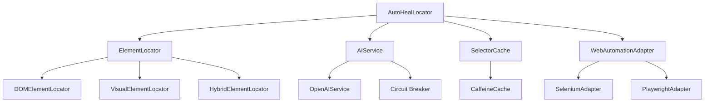

# Architecture Overview

Understanding the internal architecture of AutoHeal Locator.

## Core Components



## Component Details

### AutoHealLocator (Main Interface)

The primary entry point that orchestrates all operations:

- **Responsibility**: Coordinate element location attempts
- **Key Methods**: `findElement()`, `findElements()`
- **Dependencies**: All core components

```java
public class AutoHealLocator {
    private final ElementLocator elementLocator;
    private final AIService aiService;
    private final SelectorCache cache;
    private final WebAutomationAdapter adapter;

    public WebElement findElement(String description, String fallbackSelector) {
        // 1. Check cache first
        // 2. Try fallback selector
        // 3. Delegate to ElementLocator
        // 4. Cache successful results
    }
}
```

### ElementLocator (Strategy Pattern)

Different strategies for element location:

#### DOMElementLocator
- **Purpose**: Fast, cost-effective DOM analysis
- **Use Case**: Simple pages with stable structure
- **Cost**: $0.01-0.02 per request

#### VisualElementLocator
- **Purpose**: Visual analysis using screenshots
- **Use Case**: Complex visual layouts
- **Cost**: $0.08-0.12 per request

#### HybridElementLocator
- **Purpose**: Combines DOM and visual analysis
- **Use Case**: Balanced accuracy and cost
- **Cost**: $0.02-0.08 per request

### AIService (External Integration)

Handles AI provider communication:

```java
public interface AIService {
    CompletableFuture<LocatorResult> analyzeElement(LocatorRequest request);
    HealthStatus getHealthStatus();
}
```

**Features:**
- Circuit breaker pattern for resilience
- Retry logic with exponential backoff
- Rate limiting compliance
- Multiple AI provider support

### SelectorCache (Performance Optimization)

Intelligent caching system:

```java
public interface SelectorCache {
    Optional<CachedSelector> get(String key);
    void put(String key, CachedSelector selector, double successRate);
    void invalidate(String key);
}
```

**Cache Key Strategy:**
```
page_url + element_description + viewport_size + browser_type
```

**Eviction Policy:**
- LRU (Least Recently Used)
- Success rate threshold (removes selectors with <70% success)
- Time-based expiration

## Execution Strategies

### SMART_SEQUENTIAL (Recommended)

```java
public LocatorResult locate(LocatorRequest request) {
    // 1. Try cache
    if (cached != null && cached.getSuccessRate() > 0.8) {
        return trySelector(cached.getSelector());
    }

    // 2. Try DOM analysis (fast & cheap)
    LocatorResult domResult = domLocator.locate(request);
    if (domResult.isSuccess()) {
        return domResult;
    }

    // 3. Try visual analysis (slower but more accurate)
    return visualLocator.locate(request);
}
```

### Cost Analysis by Strategy

| Strategy | Avg Cost | Avg Time | Success Rate |
|----------|----------|----------|--------------|
| DOM_ONLY | $0.01 | 200ms | 75% |
| SMART_SEQUENTIAL | $0.03 | 800ms | 92% |
| VISUAL_FIRST | $0.10 | 1200ms | 95% |
| SEQUENTIAL | $0.06 | 1400ms | 95% |

## Error Handling

### Circuit Breaker Pattern

```java
public class ResilientAIService implements AIService {
    private final CircuitBreaker circuitBreaker;

    public CompletableFuture<LocatorResult> analyzeElement(LocatorRequest request) {
        return circuitBreaker.executeSupplier(() -> {
            return aiProvider.analyze(request);
        });
    }
}
```

**States:**
- **CLOSED**: Normal operation
- **OPEN**: Failing fast, using fallbacks
- **HALF_OPEN**: Testing if service recovered

### Fallback Hierarchy

1. **Cache Hit** → Return cached selector
2. **Fallback Selector** → Try provided CSS/XPath
3. **DOM Analysis** → Parse DOM structure
4. **Visual Analysis** → Screenshot analysis
5. **Exception** → Throw `ElementNotFoundException`

## Performance Considerations

### Memory Usage

- **Cache Size**: Configurable (default: 1000 entries)
- **Screenshot Storage**: Temporary, auto-cleanup
- **AI Response Caching**: In-memory with TTL

### Threading Model

- **Synchronous**: Main thread for DOM operations
- **Asynchronous**: AI API calls use CompletableFuture
- **Parallel**: Multiple element searches can run concurrently

### Optimization Techniques

1. **Lazy Initialization**: Components created on-demand
2. **Connection Pooling**: Reuse HTTP connections to AI APIs
3. **Batch Processing**: Group multiple requests when possible
4. **Smart Caching**: Context-aware cache keys

## Integration Points

### Selenium Integration

```java
public class SeleniumWebAutomationAdapter implements WebAutomationAdapter {
    public byte[] takeScreenshot() {
        return ((TakesScreenshot) driver).getScreenshotAs(OutputType.BYTES);
    }

    public String getPageSource() {
        return driver.getPageSource();
    }
}
```

### Spring Boot Integration

Auto-configuration provides:
- Bean registration
- Property binding
- Health checks
- Metrics collection

```java
@Configuration
@EnableConfigurationProperties(AutoHealProperties.class)
public class AutoHealAutoConfiguration {

    @Bean
    @ConditionalOnMissingBean
    public AutoHealLocator autoHealLocator(AutoHealProperties properties) {
        return new AutoHealLocator.Builder()
            .fromProperties(properties)
            .build();
    }
}
```

## Monitoring and Observability

### Metrics Collection

```java
public class LocatorMetrics {
    private final Counter totalRequests;
    private final Timer responseTime;
    private final Gauge cacheHitRate;
    private final Counter aiApiCalls;
}
```

### Health Checks

- AI Service connectivity
- Cache performance
- Error rates
- Response times

This architecture ensures scalability, reliability, and cost-effectiveness while maintaining high accuracy in element location.